# Diet app
  This application helps you in the process of dietary management by providing features like monitoring calorie intake and suggesting scaled recipes to fit your current needs.
The application was splited into two parts. The frontend part was developed using Angular and the backend part using Java Spring. 

# Signup and login

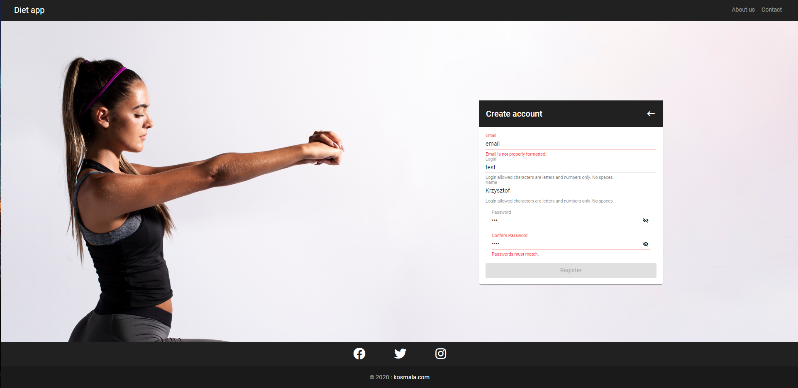
Information provided during registration must meet certain requirements. The email adress must be in email format, login and name can only consist of characters and numbers.
The password has to be entered twice in the same form to avoid typing something
by mistake. After providing the correct data and confirming it with the "Register" button, POST request is sent to the "/api/auth/signup" endpoint with data provided by
user in the body of the query. The server checks if a user with the same data does not
already exists in the database. If not, it gives it permissions and adds to the database

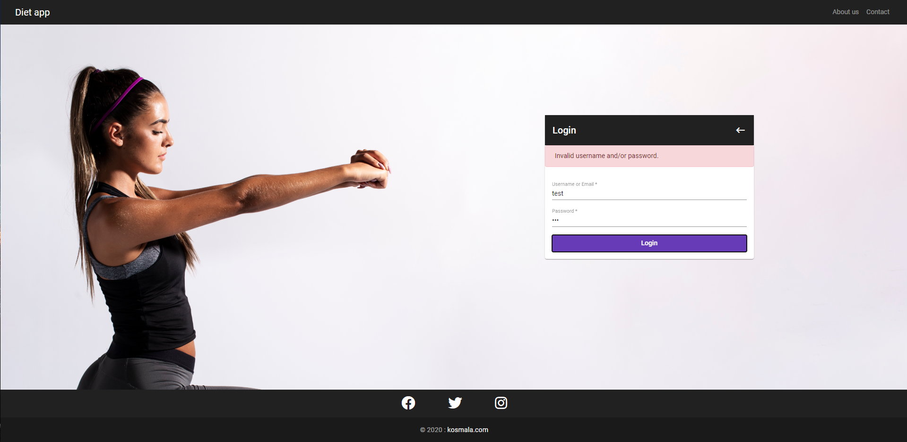
The login process is also undergo validation and the client application checks whether the given
information meets the requirements set for them. After the approval, the data are sent
to the "/api/auth/login" endpoint and if they pass the server-side validation 
the generated token returns to the user (JWT).

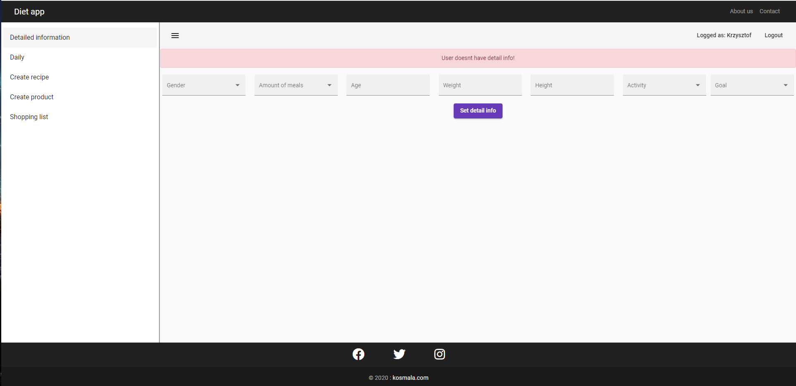

The user which has created an account and logs into the application for the first time is notified about
the need to complete the data about himself. This information is needed to calculate the daily calorie intake using the Harris Benedictas formula.
After completing the data, the algorithm determines the calorific demand using the Harris Benedictas formula and
the ratio of macro components. 
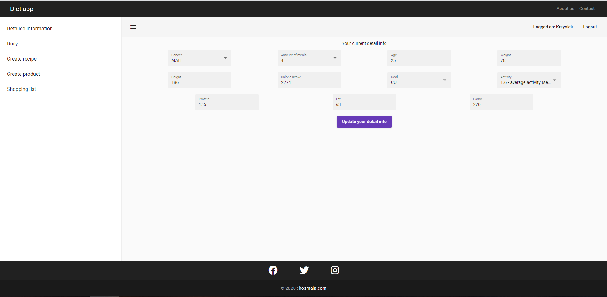
User can modify calculated values and if one of crucial value were changed algorithm calculate everything again.
# Main features
### Dairy
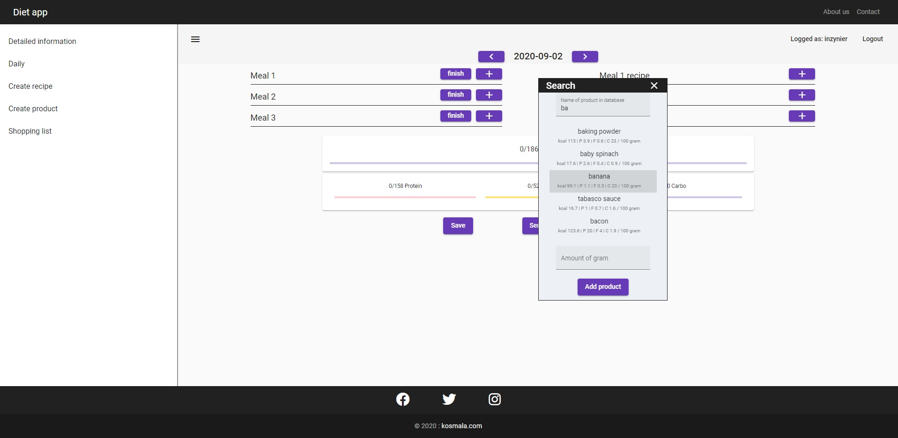
Dairy allows user to add a product to the caloric balance using the dynamic search component that appears after clicking the "plus" button. In this component, while typing each character, a request is sent to "/api/products/nameLike" and a list of products with a name that contains the characters sent is returned from the database. User can add  products searched this way to the daily balance. 

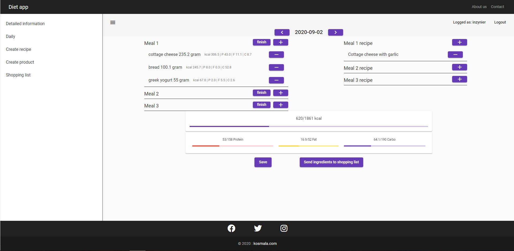
Another functionality that this view provides is recipe prompting. In order to prepare the data needed to send the request, the demand and macronutrients are divided into the number of meals each time a new day is created in the dairy. After pressing the finish button, the rest of the calories and macronutrients are allocated as requirements in the meals that have not yet been completed. After pressing the plus button in the recipe table, the recipe is searched and scaled(multiplying all ingredients by calculated multiplier) for
current data. In the example above, the user wants to search for a recipe for the second meal. His first meal is now finished and he has eaten a banana by lunchtime, so his request goes like this:

- protein = 51,0g
- fat = 16,7g
- carbo = 39g
- kcal = 520,9
- nr of meal = 2
- amount of meal = 3
- excluded recipies = Cottage cheese with garlic

Based on these data, the ratio for the recipe user is looking for is calculated:

- protein = 3,1
- fat = 1
- carbo = 2,3

The recipe presented below is closest to these ratio.

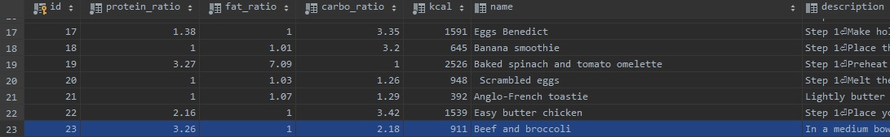

However, the starting amount of calorific value for this recipe is 911 kcal. The algorithm scales this recipe and sends it as suggestions to the user.

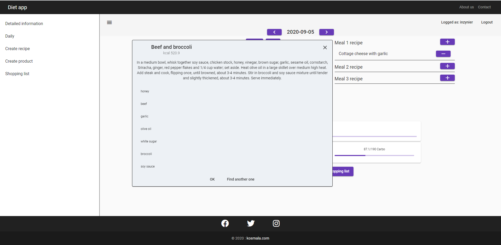
After scaling, the recipe is already matched to the request and its calorie count is 520.9
kcal, which is exactly as much as the user needs. If the user would like to find another recipe, he can now do it using the "Find another one" button.
Then the recipe that has just been shown goes to the list of excluded and will not be offered again. However, if the user approves the proposed recipe, the products needed to prepare it are included in the daily report.
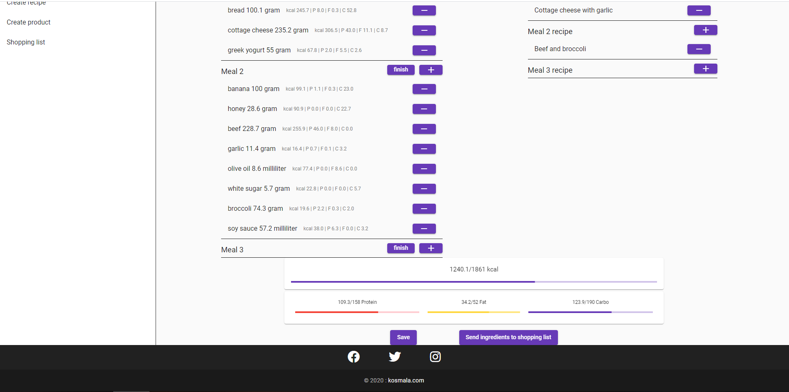
This way the user can search for recipes for each meal. A user who does not have the necessary ingredients to prepare can send them to the shopping list and look at it
in the shop.
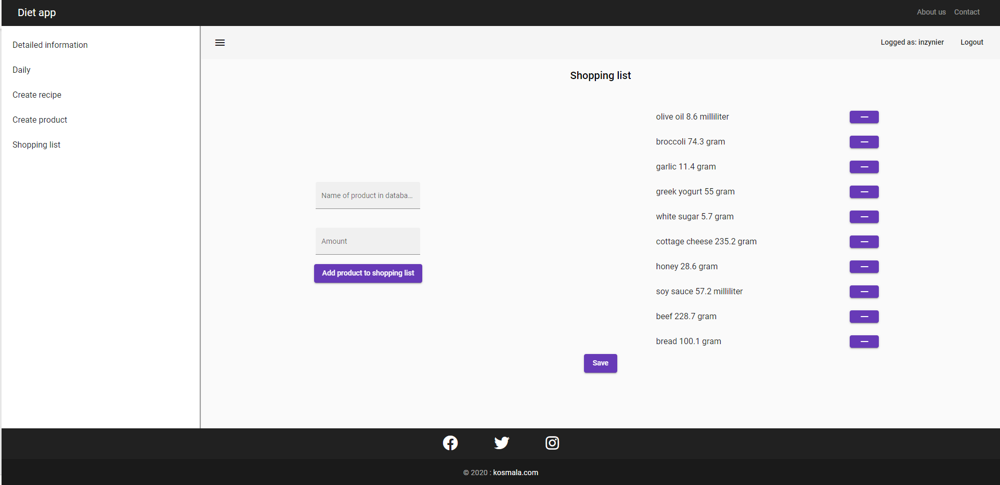
# Creating product and recipe
User is also allowed to adding products and recipies to DB.
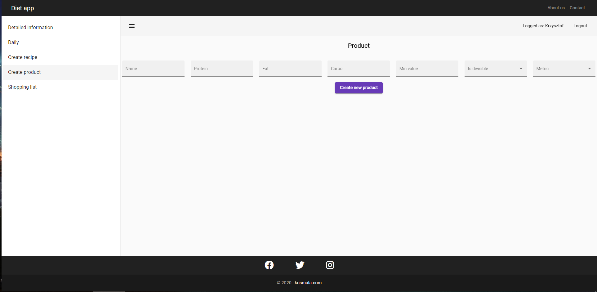
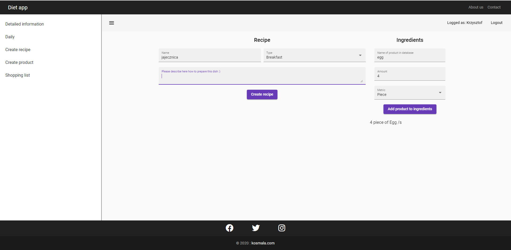

